# Finetuned RAG Systems Engineering

> CS-GY 6613 Project: A RAG system that can be used by an ROS2 robotics developer to develop the navigation stack of a agent with egomotion. This means that the robotics is the domain but the system must be particularly helpful (be able to answer very specific questions about the subdomains). The subdomains are:  
> - ros2 robotics middleware subdomain.
> - nav2 navigation subdomain.
> - movit2 motion planning subdomain.
> - gazebo simulation subdomain.

#### Team Members
- Kevin Peter
  - Email: kpk4354@nyu.edu
  - Github: github.com/KevzPeter
  - HuggingFace: https://huggingface.co/kevin-peter

- Solomon Martin
  - Email: sj4531@nyu.edu
  - Github: github.com/SolomonMartin
  - HuggingFace: https://huggingface.co/SolomonMartin

🤗 HuggingFace Finetuned Model: [Click here](https://huggingface.co/SolomonMartin/llama-3.1-robotics-finetuned-gguf) 

## 🚀 Project Milestones

### Environment and Tooling Milestone

The `docker compose file` is available [here](./docker-compose.yaml)

Here's a screenshot of the output of `docker ps` command

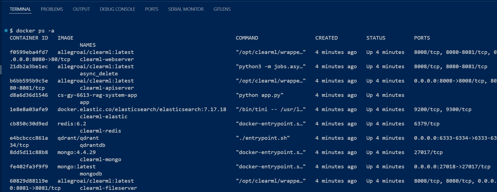


### ETL Milestone

We have used `clearml` orchestrator to ingest the following sources:
- Websites
  - Refer this json file [here](./subdomain_links.json) for the websites (sub domains) from which we crawled
- Github
  - https://github.com/ros2/ros2
  - https://github.com/ros2/ros2_documentation
  - https://github.com/ros-planning/navigation2
  - https://github.com/ros-planning/moveit2
  - https://github.com/gazebosim/gz-sim
  - https://github.com/ros-navigation/navigation2
  - https://github.com/moveit/moveit2
- Youtube transcripts (tutorials, guides, integration videos)

The ingested data is saved in `MongoDB` database, under 3 collections - `raw_docs`, `github_repo` & `youtube_transcripts`

Collections stored in MongoDB:

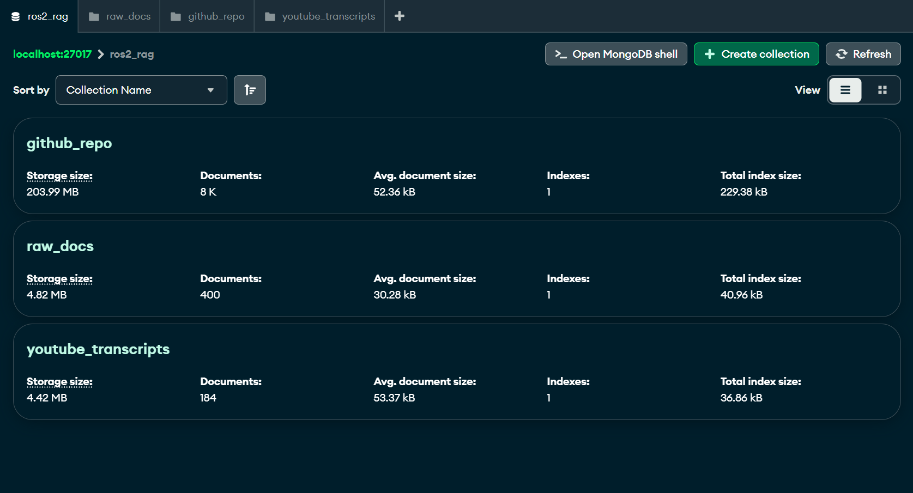

[Github Ingester](./github_ingester.py)

A Python script designed to collect and store ROS2-related documentation from various GitHub repositories. The script crawls specified repositories, extracts file contents, and stores them in MongoDB for later use in vector embeddings and RAG (Retrieval-Augmented Generation) applications.
Features
- Recursive repository content extraction
- Automatic handling of directories and files
- MongoDB integration with duplicate prevention
- ClearML tracking for monitoring and metrics
- Size limit handling (16MB max per document)

Github Data in DB:

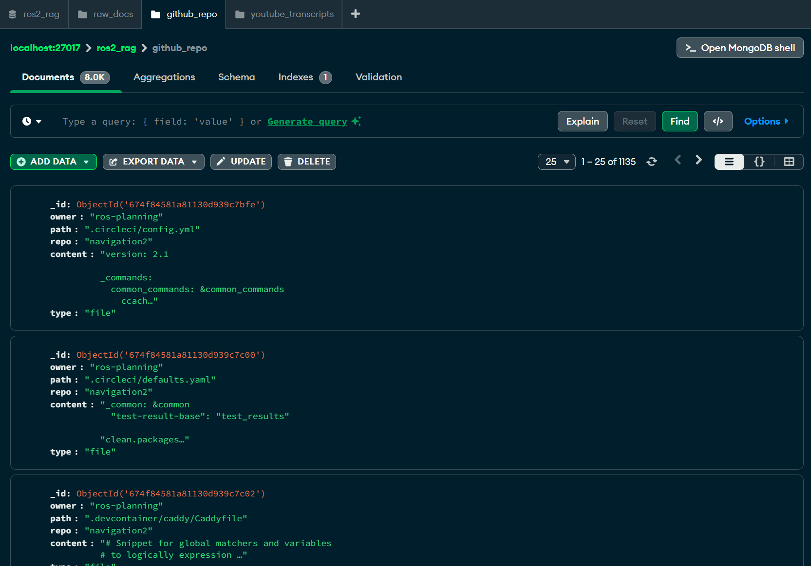

Target Repositories
- ROS2 core repositories
- Navigation2 documentation
- MoveIt2 resources
- Gazebo simulation documentation

ClearML

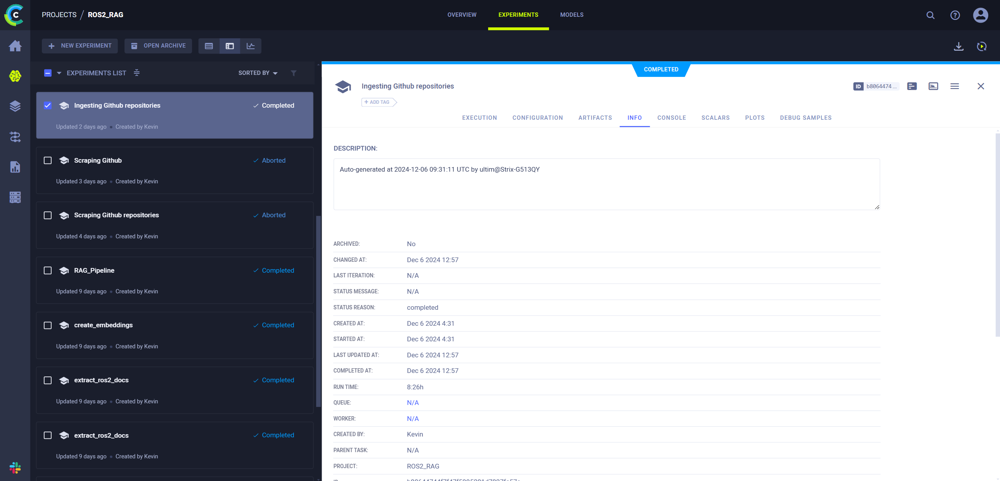

[Youtube Ingester](./youtube_ingester.py)

A Python script that automatically searches for ROS2-related YouTube videos using Google's Client Discovery API, extracts their transcripts, and stores them in MongoDB. This tool is part of a larger RAG system, collecting educational content about ROS2, navigation, MoveIt2, and Gazebo.

Features
- Automated YouTube video search
- Transcript extraction and processing
- MongoDB storage with duplicate prevention
- ClearML integration for tracking
- Support for multiple ROS2-related topics

Search Categories
- ROS2 tutorials
- Navigation2 guides
- MoveIt2 tutorials
- Gazebo integration
- ROS2 Humble tutorials

Youtube Transcripts data:

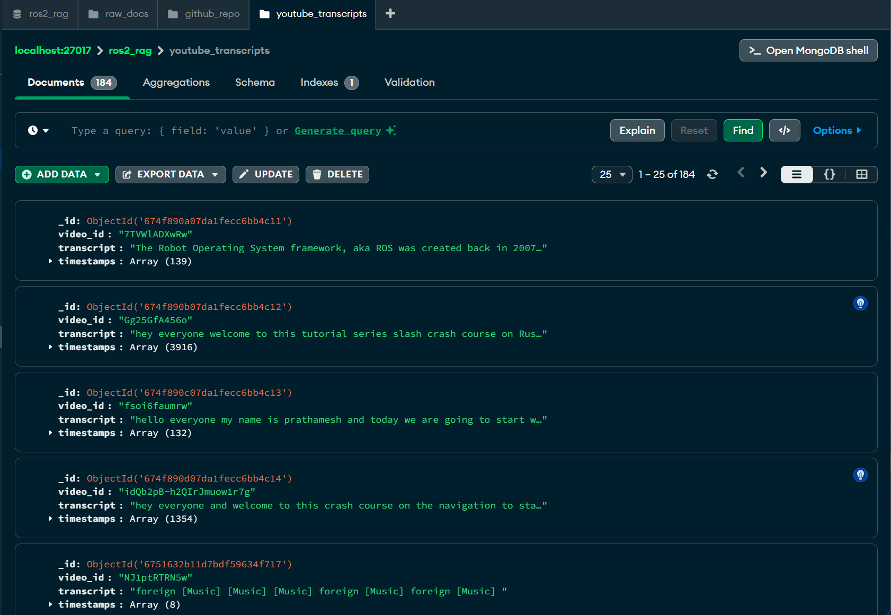

[Web Crawler](./web_crawler.py)


A Python web crawler designed to extract documentation and code examples from ROS2-related websites. The crawler systematically visits web pages, extracts text content and code snippets, while respecting domain boundaries and page limits.

Features
- Domain-restricted crawling
- Text and code snippet extraction
- Automatic link discovery
- Duplicate URL prevention
- Configurable page limit
- HTML cleaning and formatting

Content Extraction
- Main text content
- Code examples from `<code>` and `<pre>` tags
- Internal links for navigation
- Stripped of scripts and styling

### Featurization Pipelines Milestone

Here's the code python script for featurization pipeline: [featurizer.py](./featurizer.py)

The featurization pipeline processes data from multiple sources (GitHub repositories, web documentation, and YouTube transcripts) and transforms them into vector embeddings for use in our RAG system. The pipeline follows three main steps as shown in the diagram: Clean, Chunk, and Embed.

#### Pipeline Components

##### 1. Data Cleaning
- Removes URLs and special characters
- Normalizes whitespace
- Handles text validation and empty content
- Preserves essential punctuation (periods, hyphens)

##### 2. Text Chunking
- Splits text into semantic chunks using sentence tokenization
- Maintains context with a maximum chunk size of 512 tokens
- Preserves sentence boundaries for better coherence
- Handles overflow with intelligent chunk management

##### 3. Vector Embedding
- Uses the `all-MiniLM-L6-v2` model for creating embeddings
- Processes chunks in batches for efficiency
- Adds rich metadata to each vector:
  - Source type (github/web/youtube)
  - Original URL
  - Content type
  - Full text chunk

##### 4. Storage
- Initializes and manages Qdrant vector database
- Implements batch processing (100 vectors per batch)
- Uses COSINE similarity for vector comparisons
- Generates unique IDs for each vector entry

#### Data Sources Integration
The pipeline processes three main data sources:
- **GitHub Repositories**: Code documentation and README files
- **Web Documentation**: ROS2 official documentation and tutorials
- **YouTube Transcripts**: Tutorial video transcripts

#### Monitoring
- Progress tracking through **ClearML**
- Batch upload monitoring
- Processing status for each data source
- Vector creation metrics

The pipeline ensures all processed data is properly cleaned, chunked, and embedded before being stored in the vector database for efficient retrieval during the RAG process.

Vector data in QdrantDB:

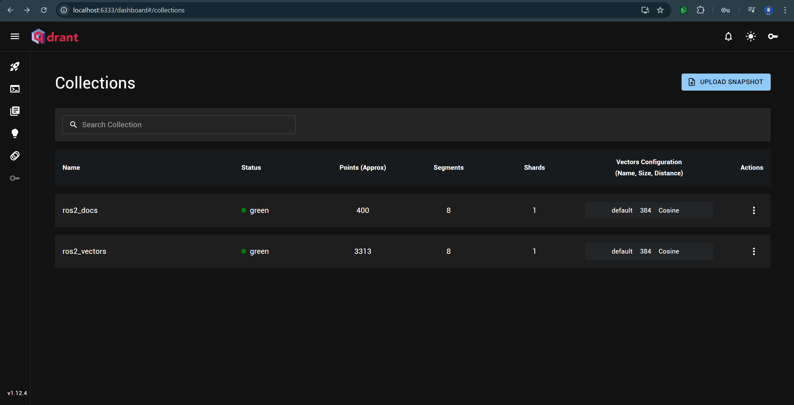

Sample Point

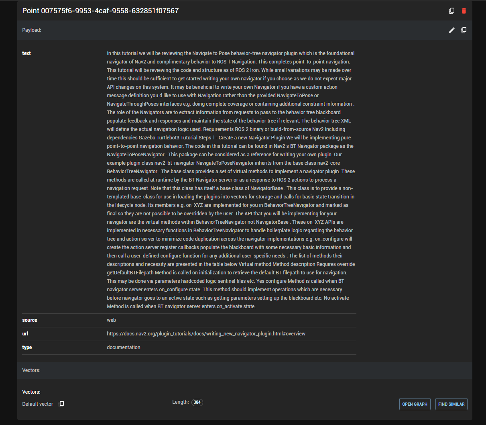

Data visualization

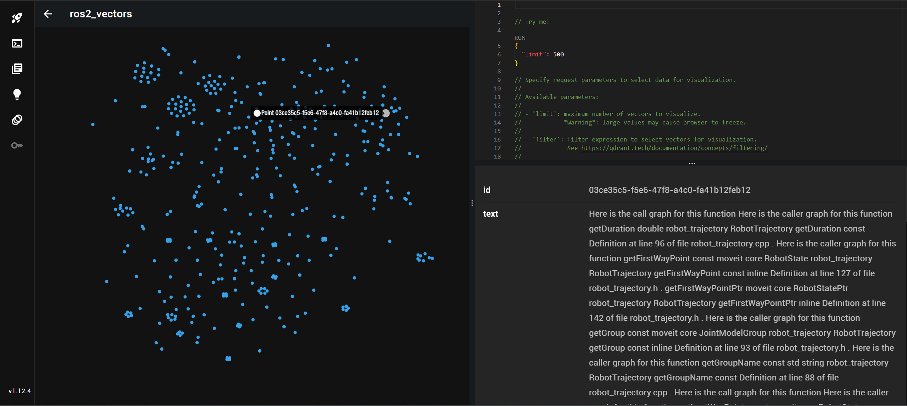

### Finetuning Milestone


The fine-tuning pipeline transforms a base LLaMA 3.2 model into a robotics-specialized model through two main components: Dataset Creation and Model Fine-tuning. The pipeline follows a structured approach to generate high-quality training data and efficiently fine-tune the model.

### Pipeline Components

**1. Instruction Dataset Creation**

[Click here for instruction dataset creation script](./finetuning/finetune_ds.py)

- Generates domain-specific Q&A pairs across robotics domains
- Implements robust error handling and validation
- Components:
  - JSON validation and cleaning
  - Rate-limited API interactions
  - Progress tracking and logging
  - Batch processing with retries

**2. Model Fine-tuning**

[Click here for LLM Finetuning Notebook](./finetuning/Finetune.ipynb)

- Uses LoRA for efficient parameter updates
- Implements 4-bit quantization for memory optimization
- Includes comprehensive training monitoring
- Components:
  - Dataset preprocessing
  - Model configuration
  - Training management
  - Model merging and deployment

### Data Generation Process

**Domain Coverage**

### Domain Descriptions and Example Subtopics

#### ROS2
- **Description**: Middleware and core concepts
- **Example Subtopics**: nodes, topics, services

#### Nav2
- **Description**: Navigation and path planning
- **Example Subtopics**: costmaps, planners, controllers

#### MoveIt2
- **Description**: Motion planning and manipulation
- **Example Subtopics**: kinematics, collision, trajectories

#### Gazebo
- **Description**: Robot simulation and testing
- **Example Subtopics**: worlds, models, plugins


**Topic Categories**
- Installation procedures
- Configuration guides
- Implementation details
- Troubleshooting steps
- Optimization techniques
- Integration methods
- Best practices
- Error handling

### Training Pipeline

**Data Preprocessing**
- Cleans and validates JSON format
- Implements consistent instruction-response formatting
- Handles token length constraints
- Manages special characters and formatting

**Fine-tuning Configuration**
- Uses 4-bit quantization (BitsAndBytes)
- Implements LoRA with r=64 rank
- Applies gradient checkpointing
- Configures optimal batch sizes and learning rates

**Training Management**
- Tracks progress through Weights & Biases
- Implements checkpoint saving
- Monitors training metrics
- Handles model merging and deployment

### Monitoring and Metrics

**Dataset Creation Metrics**
- Generation success rate
- Domain coverage statistics
- Error rates and types
- Processing speed

**Training Metrics**
- Loss curves
- Learning rate progression
- Memory usage
- Training speed
- Model performance indicators


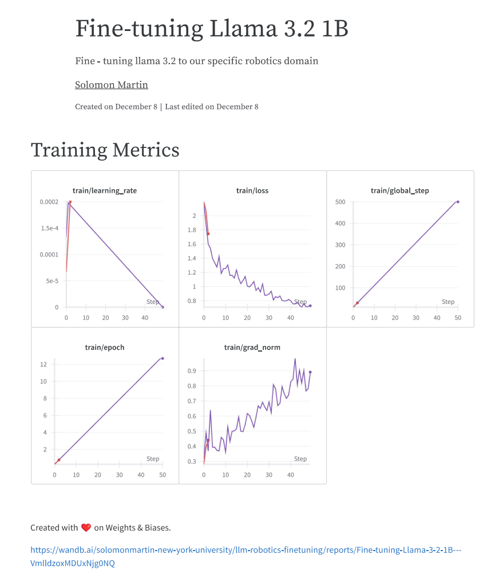

[https://api.wandb.ai/links/solomonmartin-new-york-university/41dmt4n0]

### Output Formats

**Dataset Format**
```json
{
    "instruction": "Technical robotics question",
    "response": "Detailed technical answer"
}
```

**Model Artifacts**
- LoRA weights
- Merged model
- Tokenizer configuration
- Model configuration

The pipeline ensures systematic creation of high-quality training data and efficient model fine-tuning, resulting in a robotics-specialized language model capable of handling technical queries across multiple robotics domains.

### Deploying the App Milestone

The UI was built using Gradio and the finetuned LLM was downloaded from HuggingFace and run using Ollama.

Ollama LLM models (using `ollama list`):

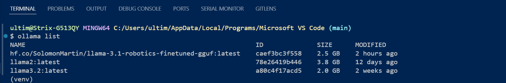

- The UI consists a dropdown with the two common questions given on the assignment page, which, upon being selected, loads the user's query box.
- The user is also free to ask questions of his choice.
- There is a chat window which displays the chat history.

Question: Tell me how can I navigate to a specific pose - include replanning aspects in your answer.

Answer:

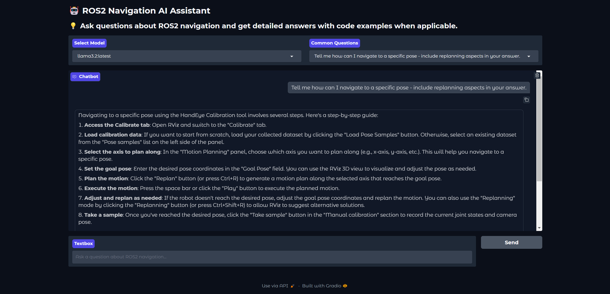


Question: Can you provide me with code for this task?

Answer:

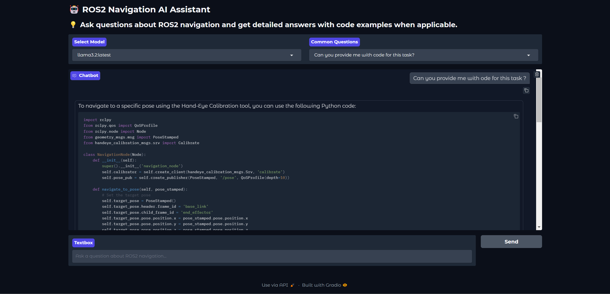

Response received:
```python
import rclpy
from rclpy.qos import QoSProfile
from rclpy.node import Node
from geometry_msgs.msg import PoseStamped
from handeye_calibration_msgs.srv import Calibrate

class NavigationNode(Node):
    def __init__(self):
        super().__init__('navigation_node')
        self.calibrator = self.create_client(handeye_calibration_msgs.Srv, 'calibrate')
        self.pose_pub = self.create_publisher(PoseStamped, '/pose', QoSProfile(depth=10))

    def navigate_to_pose(self, pose_stamped):
        # Set the target pose
        self.target_pose = PoseStamped()
        self.target_pose.header.frame_id = 'base_link'
        self.target_pose.child_frame_id = 'end_effector'
        self.target_pose.pose.position.x = pose_stamped.pose.position.x
        self.target_pose.pose.position.y = pose_stamped.pose.position.y
        self.target_pose.pose.position.z = pose_stamped.pose.position.z
        self.target_pose.pose.orientation.w = 1

        # Create a new request for the calibration service
        request = handeye_calibration_msgs.Srv.CalibrateRequest()
        request.pose_samples = []
        request.pose_samples.append(pose_stamped)

        # Call the calibration service to get the target pose in the camera frame
        self.get_client().calibrate(request)

        # Get the target pose in the camera frame
        response = self.calibrator.call(request)
        camera_pose = response.camera_transform

        # Convert the camera pose to a PoseStamped message
        camera_pose_msg = PoseStamped()
        camera_pose_msg.header.frame_id = 'camera'
        camera_pose_msg.child_frame_id = 'end_effector'
        camera_pose_msg.pose.position.x = camera_pose.transform.translation.x
        camera_pose_msg.pose.position.y = camera_pose.transform.translation.y
        camera_pose_msg.pose.position.z = camera_pose.transform.translation.z
        camera_pose_msg.pose.orientation.w = camera_pose.transform.rotation.w

        # Publish the target pose
        self.pose_pub.publish(camera_pose_msg)

    def replan(self):
        # Replan to the target pose using the motion planning group
        self.get_client().motion_planning_group(replan=True, target_pose=self.target_pose)

def main(args=None):
    rclpy.init(args=args)
    node = NavigationNode()
    try:
        while True:
            pose_stamped = PoseStamped()
            # Get a new pose from the user or use a predefined pose
            # ...
            node.navigate_to_pose(pose_stamped)
            node.replan()
    except KeyboardInterrupt:
        pass

if __name__ == '__main__':
    main()
```